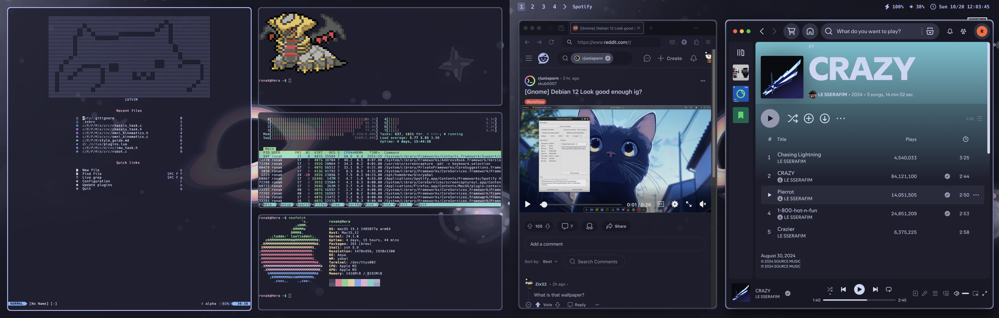

# MacOS

## [Neovim](https://neovim.io/)
Text Editor of choice
- Vim motions
- [Catppuccin](https://github.com/catppuccin/nvim) Theme
- [Plugins](https://github.com/folke/lazy.nvim) - Plugin manager
	- [Autopairs](https://github.com/windwp/nvim-autopairs) - Automatically close braces, parentheses and quotes
	- [Alpha](https://github.com/goolord/alpha-nvim) - Startup screen (catvim)
	- [Autosave](https://github.com/0x00-ketsu/autosave.nvim) - Automatically save on edits
	- [Autotag](https://github.com/windwp/nvim-ts-autotag) - Automatically close html tags
	- [Highlight-Colors](https://github.com/brenoprata10/nvim-highlight-colors) - Highlights color values with corresponding color
	- LSP - Language features like diagnostics, completion, and formatting
		- [Mason](https://github.com/williamboman/mason.nvim) - Package manager
		- [LSPConfig](https://github.com/neovim/nvim-lspconfig) - Configures servers for use with Neovim
		- [Mason-LSPConfig](https://github.com/williamboman/mason-lspconfig.nvim) - Integrates configurations with Mason
		- [Conform](https://github.com/stevearc/conform.nvim) - Formatting text
		- [Mason-Conform](https://github.com/zapling/mason-conform.nvim) - Integrate formatters with Mason
		- [Lazydev](https://github.com/folke/lazydev.nvim) - Proper lua integration for config and plugin development
		- [nvim-cmp](https://github.com/hrsh7th/nvim-cmp) - Completion menu
		- [LuaSnip](https://github.com/L3MON4D3/LuaSnip) - Snippets
		- [comment.nvim](https://github.com/numToStr/Comment.nvim) - Commenting
	- [Lualine](https://github.com/nvim-lualine/lualine.nvim) - Better status bar
	- [Oil](https://github.com/stevearc/oil.nvim) - File manager as a buffer
	- [Telescope](https://github.com/nvim-telescope/telescope.nvim) - Fuzzy finding files
	- [Treesitter](https://github.com/nvim-treesitter/nvim-treesitter) - Parses languages and provides syntax highlighting
	- [Vimtex](https://github.com/lervag/vimtex) - Latex integration
	- [Wit](https://github.com/Aliqyan-21/wit.nvim) - Google search from Neovim
## [Kitty](https://github.com/kovidgoyal/kitty)
Terminal emulator of choice
- [Catppuccin](https://github.com/catppuccin/kitty) Theme
- [Hack Nerd Font Mono](https://github.com/ryanoasis/nerd-fonts)
## [zsh](https://www.zsh.org/)
Shell of choice
- [Oh-my-zsh](https://github.com/ohmyzsh/ohmyzsh) for configuration
- Git, syntax highlighting, autosuggestions, and interactive cd plugins.
- alanpeabody prompt
## [Yabai](https://github.com/koekeishiya/yabai)
Tiling window manager for MacOS
- I have disabled SIP which allows for workspaces
- Inactive windows are slightly transparent
## [MacOS](https://www.apple.com/macos/macos-sequoia/)
OS that comes with the best laptops
- Command -> Option (Alt in windowsland)
- Option -> Control (Ctrl in windowsland)
- Control -> Command (Windows key(?) in windowsland)
- Caps Lock -> Esc
## [skhd](https://github.com/koekeishiya/skhd)
Keybindings
- Alt - k: Kitty
- Alt - r: Spotlight
- Alt - t: Firefox
- Alt - j: Focus left monitor
- Alt - l: Focus right monitor
- Alt - Ctrl - left: Send window to left monitor
- Alt - Ctrl - right: Send window to right monitor
- Alt - {up, down, left, right}: Focus window in direction
- Alt - Shift - {up, down, left, right}: Switch with window in direction
- Alt - {1, 2, 3, 4}: Switch to corresponding workspace
- Alt - Shift - {1, 2, 3, 4}: Send window to corresponding workspace
- Alt - w: Send Cmd - w to window = Close tab
- Alt - q: Send Cmd - q to window = Kill program
- Alt - x: Close window
## [SketchyBar](https://github.com/FelixKratz/SketchyBar)
Status bar to take up awkward notch space
## [JankyBorders](https://github.com/FelixKratz/JankyBorders)
Borders around windows
- Orange - active windows
- Gray - inactive windows
## [Firefox](https://www.mozilla.org/en-US/firefox/)
Browser of choice
- [Catppuccin](https://github.com/catppuccin/firefox) Theme
- [Vimium](https://github.com/philc/vimium) - Vim motions in firefox
- [Dark Reader](https://github.com/darkreader/darkreader) - Turn any website into [catppuccin](https://github.com/catppuccin/dark-reader)
- [Stylus](https://github.com/openstyles/stylus) - Userstyles = [catppuccin](https://github.com/catppuccin/userstyles) for many common websites
- [UBlock Origin](https://github.com/gorhill/uBlock) - Adblocker that works
## [Spotify](https://spotify.com)
Good music
- [Spicetify](https://github.com/spicetify/cli) - Make spotify [catppuccin](https://github.com/catppuccin/spicetify)
# Linux
Coming soon
