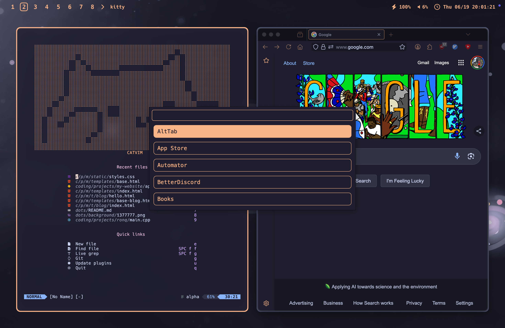

# Dotfiles

This repository stores my personal configuration for macOS



## Quick Setup

```bash
git clone https://github.com/ronak/dots.git ~/dots
cd ~/dots && ./setup-mac.sh
```

The script installs everything: Homebrew, packages, Oh My Zsh, plugins, symlinks, Neovim plugins, services, and macOS defaults.

## Repository layout
- `macconfig/` – macOS services, keybindings, and status bar configs.
- `linuxconfig/` – Linux-specific helpers and terminals.
- `vim/` – Vim/Neovim configuration, plugins, and runtime files.
- `setup-mac.sh` – Full Mac bootstrap script.
- Top-level files such as `maczshrc`, `linuxzshrc`, `vimrc` are symlinked into `~/`.

## What gets installed

### Homebrew Formulae

| Category | Packages |
|---|---|
| **Tiling WM** | yabai, skhd, sketchybar, borders |
| **Terminal & Shell** | eza, fzf, fd, ripgrep, zoxide, vivid, tree |
| **Editors** | neovim |
| **Languages** | python@3.13, node, go, rust, bun, lua, luajit |
| **LSP & Formatters** | stylua, prettier, latexindent, gopls, rust-analyzer, lua-language-server, texlab, verible, neocmakelsp, tree-sitter |
| **Build Tools** | cmake, make, gcc, ninja, meson, pkgconf |
| **CLI Utilities** | gh, git, jq, wget, btop, fastfetch, ncdu, pstree, htop |
| **Media** | ffmpeg, yt-dlp, mpv, imagemagick |
| **Misc** | spicetify-cli, mactop, deno, uv |

### GitHub Releases

| App | Source |
|---|---|
| [Mofi](https://github.com/ronakpjain/mofi) | Latest release — Spotlight replacement with theming |

### Homebrew Casks

| Category | Packages |
|---|---|
| **Fonts** | font-hack-nerd-font, font-jetbrains-mono-nerd-font |
| **Window Mgmt** | hammerspoon, alt-tab |
| **Browsers** | firefox@nightly, google-chrome |
| **Terminals** | kitty, ghostty, wezterm |
| **Editors** | visual-studio-code@insiders, zed, codex |
| **Media** | iina, spotify, sioyek, skim |
| **Dev Tools** | docker-desktop |
| **Productivity** | tailscale-app, slack@beta, thunderbird, transmission |

### Shell Setup
- [Oh My Zsh](https://github.com/ohmyzsh/ohmyzsh) with plugins: git, zsh-autosuggestions, zsh-syntax-highlighting, zsh-interactive-cd
- [Catppuccin Mocha](https://github.com/catppuccin/zsh-syntax-highlighting) syntax highlighting theme
- [fzf](https://github.com/junegunn/fzf) fuzzy finder with Catppuccin colors
- [vivid](https://github.com/sharkdp/vivid) LS_COLORS with Catppuccin Mocha
- [eza](https://github.com/eza-community/eza) as `ls` replacement with icons

### Symlinks

| Source | Target |
|---|---|
| `dots/maczshrc` | `~/.zshrc` |
| `dots/vimrc` | `~/.vimrc` |
| `dots/vim/` | `~/.vim/` |
| `dots/macconfig/nvim/` | `~/.config/nvim/` |
| `dots/macconfig/kitty/` | `~/.config/kitty/` |
| `dots/macconfig/yabai/` | `~/.config/yabai/` |
| `dots/macconfig/skhd/` | `~/.config/skhd/` |
| `dots/macconfig/sketchybar/` | `~/.config/sketchybar/` |
| `dots/macconfig/hammerspoon/` | `~/.hammerspoon/` |
| `dots/macconfig/borders/` | `~/.config/borders/` |
| `dots/macconfig/opencode/` | `~/.config/opencode/` |
| `dots/macconfig/mofi/` | `~/.config/mofi/` |

### macOS Defaults Applied
- Fast key repeat (KeyRepeat=2, InitialKeyRepeat=15)
- Disable press-and-hold (key repeat instead)
- Show hidden files and extensions in Finder
- Disable .DS_Store on network volumes
- Disable quarantine dialog for downloaded apps
- Expand save/print panels by default

## [Neovim](https://neovim.io/)
Text Editor of choice
- Vim motions
- [Catppuccin](https://github.com/catppuccin/nvim) Theme
- [lazy.nvim](https://github.com/folke/lazy.nvim) - Plugin manager
- **UI & Appearance**
    - [Alpha](https://github.com/goolord/alpha-nvim) - Startup dashboard
    - [Catppuccin](https://github.com/catppuccin/nvim) - Colorscheme
    - [Highlight-Colors](https://github.com/brenoprata10/nvim-highlight-colors) - Inline color previews
    - [Lualine](https://github.com/nvim-lualine/lualine.nvim) - Status bar
    - [Dropbar](https://github.com/Bekaboo/dropbar.nvim) - Breadcrumb winbar
    - [Fidget](https://github.com/j-hui/fidget.nvim) - LSP progress spinner
    - [Snacks](https://github.com/folke/snacks.nvim) - Image rendering & utilities
    - [Which-Key](https://github.com/folke/which-key.nvim) - Keymap popup
    - [Rainbow Delimiters](https://gitlab.com/HiPhish/rainbow-delimiters.nvim) - Rainbow brackets
    - [Zen Mode](https://github.com/folke/zen-mode.nvim) - Distraction-free mode
- **Editing**
    - [Autopairs](https://github.com/windwp/nvim-autopairs) - Auto-close brackets/quotes
    - [Autosave](https://github.com/okuuva/auto-save.nvim) - Auto-save on edit
    - [Surround](https://github.com/kylechui/nvim-surround) - Surround text objects
    - [Go-Up](https://github.com/nullromo/go-up.nvim) - Navigate up directories
- **Navigation**
    - [Telescope](https://github.com/nvim-telescope/telescope.nvim) - Fuzzy finder
        - [telescope-ui-select](https://github.com/nvim-telescope/telescope-ui-select.nvim) - Use Telescope for code actions
        - [telescope-fzf-native](https://github.com/nvim-telescope/telescope-fzf-native.nvim) - FZF sorter
    - [Oil](https://github.com/stevearc/oil.nvim) - File manager as a buffer
- **LSP & Completion**
    - [LSPConfig](https://github.com/neovim/nvim-lspconfig) - LSP server configs
    - [Lazydev](https://github.com/folke/lazydev.nvim) - Lua dev type hints
    - [lsp_lines](https://git.sr.ht/~whynothugo/lsp_lines.nvim) - Virtual line diagnostics
    - [nvim-cmp](https://github.com/hrsh7th/nvim-cmp) - Completion engine
        - [cmp-nvim-lsp](https://github.com/hrsh7th/cmp-nvim-lsp) - LSP completions
        - [cmp-buffer](https://github.com/hrsh7th/cmp-buffer) - Buffer completions
        - [cmp-path](https://github.com/hrsh7th/cmp-path) - Path completions
        - [cmp-cmdline](https://github.com/hrsh7th/cmp-cmdline) - Command-line completions
        - [cmp_luasnip](https://github.com/saadparwaiz1/cmp_luasnip) - Snippet completions
    - [LuaSnip](https://github.com/L3MON4D3/LuaSnip) - Snippet engine
        - [friendly-snippets](https://github.com/rafamadriz/friendly-snippets) - Snippet collection
        - [luasnip-latex-snippets](https://github.com/iurimateus/luasnip-latex-snippets.nvim) - LaTeX snippets
    - [Conform](https://github.com/stevearc/conform.nvim) - Formatting (stylua, prettier, latexindent, rustfmt, clang-format)
- **Git**
    - [Neogit](https://github.com/NeogitOrg/neogit) - Git interface
    - [Diffview](https://github.com/sindrets/diffview.nvim) - Diff viewer
- **Debugging**
    - [DAP](https://github.com/mfussenegger/nvim-dap) - Debug adapter protocol
    - [nvim-dap-ui](https://github.com/rcarriga/nvim-dap-ui) - Debug UI
    - [nvim-nio](https://github.com/nvim-neotest/nvim-nio) - Async IO for DAP
- **Markdown & LaTeX**
    - [render-markdown](https://github.com/MeanderingProgrammer/render-markdown.nvim) - Rendered Markdown previews
    - [mdmath](https://github.com/ronakpjain/mdmath.nvim) - LaTeX math rendering
    - [markdown-plus](https://github.com/yousefhadder/markdown-plus.nvim) - Markdown utilities
- **Treesitter**
    - [nvim-treesitter](https://github.com/nvim-treesitter/nvim-treesitter) - Syntax highlighting & parsing
- **Misc**
    - [Teamtype](https://github.com/teamtype/teamtype-nvim) - Collaborative editing

## [Kitty](https://github.com/kovidgoyal/kitty)
Terminal emulator of choice
- [Catppuccin](https://github.com/catppuccin/kitty) Theme
- [Hack Nerd Font Mono](https://github.com/ryanoasis/nerd-fonts)
## [zsh](https://www.zsh.org/)
Shell of choice
- [Oh-my-zsh](https://github.com/ohmyzsh/ohmyzsh) for configuration
- Git, syntax highlighting, autosuggestions, and interactive cd plugins.
- alanpeabody prompt
## [Yabai](https://github.com/koekeishiya/yabai)
Tiling window manager for MacOS
- I have disabled SIP which allows for workspaces
- Inactive windows are slightly transparent
## [MacOS](https://www.apple.com/macos/macos-sequoia/)
OS that comes with the best laptops
- Command -> Option (Alt in windowsland)
- Option -> Control (Ctrl in windowsland)
- Control -> Command (Windows key(?) in windowsland)
- Caps Lock -> Esc
## [skhd](https://github.com/koekeishiya/skhd)
Keybindings
- Alt - e: BSP layout
- Alt - s: Stack layout
- Alt - f: Toggle fullscreen
- Alt - k: Kitty
- Alt - r: Open mofi
- Alt - t: Firefox Nightly
- Alt - a: Use warpd hints
- Alt - j: Focus left monitor
- Alt - l: Focus right monitor
- Alt - o: Focus west
- Alt - p: Focus east
- Ctrl - Alt - left: Send window to left monitor
- Ctrl - Alt - right: Send window to right monitor
- Alt - {up, down, left, right}: Focus window in direction
- Alt - Shift - {up, down, left, right}: Switch with window in direction
- Shift - Alt - {1-8}: Send window to corresponding workspace
- Alt - {1-8}: Switch to corresponding workspace
- Alt - w: Send Cmd - w to window = Close tab
- Alt - q: Send Cmd - q to window = Kill program
- Alt - x: Close window
- Alt - c: Open Neko
## [SketchyBar](https://github.com/FelixKratz/SketchyBar)
Status bar to take up awkward notch space
## [JankyBorders](https://github.com/FelixKratz/JankyBorders)
Borders around windows
- Orange - active windows
- Gray - inactive windows
## [Firefox](https://www.mozilla.org/en-US/firefox/)
Browser of choice
- [Catppuccin](https://github.com/catppuccin/firefox) Theme
- [Vimium](https://github.com/philc/vimium) - Vim motions in firefox
- [Dark Reader](https://github.com/darkreader/darkreader) - Turn any website into [catppuccin](https://github.com/catppuccin/dark-reader)
- [Stylus](https://github.com/openstyles/stylus) - Userstyles = [catppuccin](https://github.com/catppuccin/userstyles) for many common websites
- [UBlock Origin](https://github.com/gorhill/uBlock) - Adblocker that works
## 
- Spotlight replacement with theming
- (it's mine)
